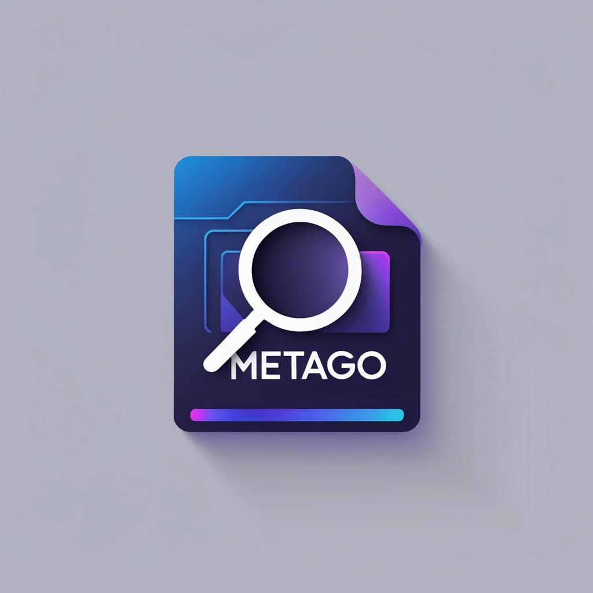

<p align="center">
  
</p>

# MetaGo · 🧰📁

[](https://golang.org)
[](LICENSE)
[]()

A minimal, concurrent CLI tool to extract file metadata and hashes (SHA256/MD5) from files or directories.

---

## ✨ Features

- Extract filename, size, modified time.
- Compute SHA256 or MD5 hashes.
- Directory traversal with goroutines.
- Output in plaintext or JSON (WIP).
- Simple, clean structure with extensibility in mind.

---

## 📦 Installation

### 🔧 Option 1: Build from source

```bash
git clone https://github.com/0xM3H51N/MetaGo.git
cd MetaGo
go build -o metago
```

### 📥 Option 2: Install via Go

```bash
go install github.com/0xM3H51N/MetaGo@latest
```

Make sure `GOBIN` is in your `$PATH`.

---

## 🚀 Usage

```bash
metago --file /path/to/file.txt
metago --dir /path/to/folder --hash md5
metago --file /path/to/file --json
```

### Flags

| Flag       | Description                         | Default  |
|------------|-------------------------------------|----------|
| `-f`       | Path to a single file               |          |
| `-d`       | Path to a directory                 |          |
| `--json`   | Output in JSON format               | `false`  |
| `-h`       | Hashing algorithm (md5 or sha256)   | `sha256` |
| `-r`       | Recursively scan subdirectories     | `false`  |
| `-v`       | Recursively scan subdirectories     | `false`  |

> Only one of `--file` or `--dir` can be used at a time.

---

## 🧪 Output (Example)

```
Name: report.pdf
Size: 1.2 MB
Hash: 98af71c...
ModTime: 2025-07-20 13:12:01 +0100
```

---

```json
{
  "Name": "report.pdf",
  "Size": 1253171,
  "Hash": "98af71c...",
  "ModTime": "2025-07-20T13:12:01+01:00"
}
```
---

## 📁 Project Structure

<pre>
MetaGo/
├── cmd/         # CLI commands and orchestration
├── internal/    # Internal packages (hashing)
├── core/        # Shared types/interfaces
├── main.go      # Entry point
├── go.mod
└── README.md
</pre>

---

## ✅ Completed Features

- Metadata extraction
- File hashing (SHA256 / MD5)
- JSON output
- Recursive directory walk
- Concurrent processing with goroutines

---

## 🧪 Coming Soon
- Final testing and verification
- File type detection
- Unit tests

---

## 🔖 Versioning

This project uses [Semantic Versioning](https://semver.org/).  
You are currently viewing **v0.9.0**, a feature-complete pre-release candidate pending final testing and verification.  

Once fully tested and verified, MetaGo will reach **v1.0.0**, the first stable release.

---

## 🧑‍💻 Author

**[@0xM3H51N](https://github.com/0xM3H51N)**

---

Licensed under the MIT License.
